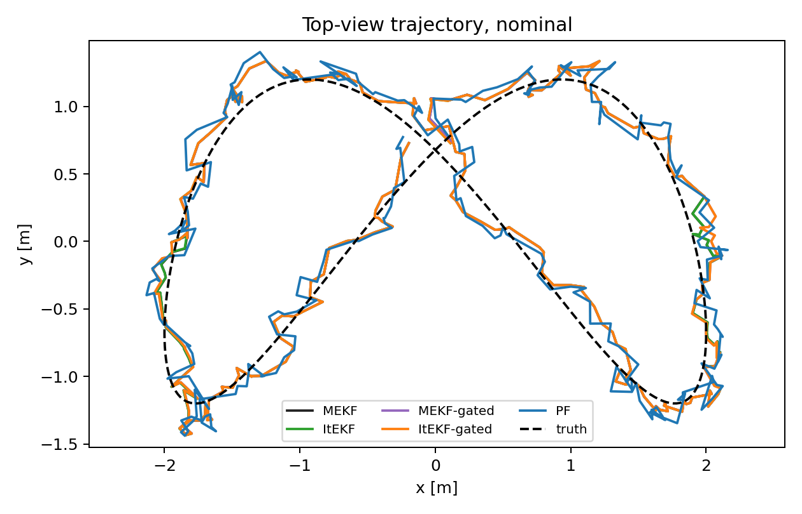
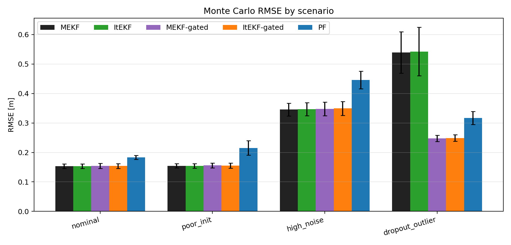
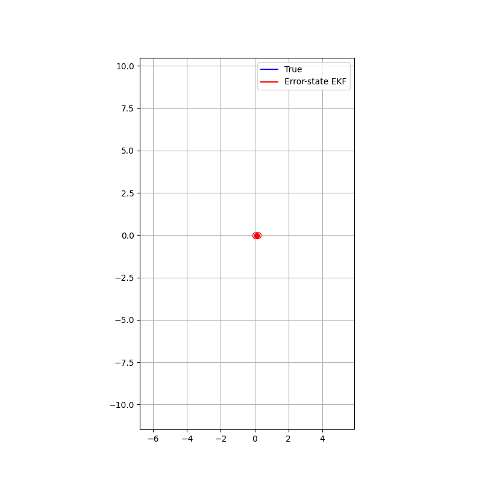
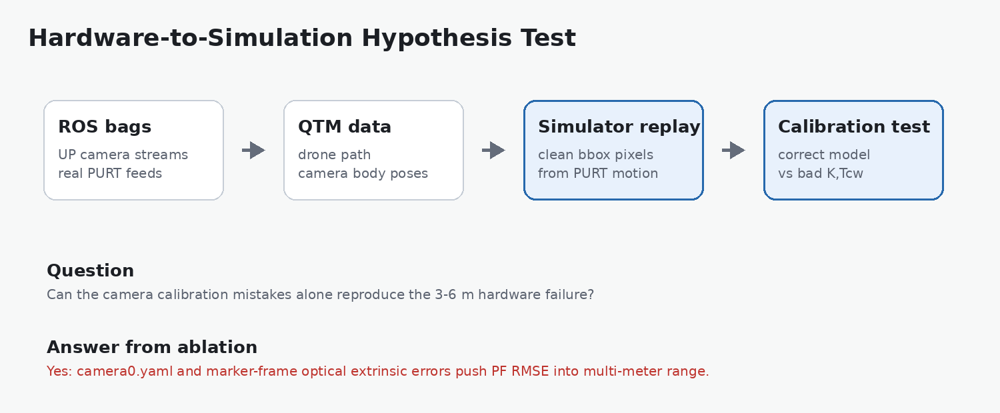

# AAE 590 - Lie Group Methods for Estimation and Control

Course portfolio for **Lie Group Methods for Estimation and Control**. This repository collects Kalman filtering notebooks, EKF visualizations, and a final project on Lie-group-aware multi-camera UAV tracking with particle filtering, EKF variants, hardware calibration studies, and result visualizations.

## Highlights

| Particle filter trajectory | Filter RMSE comparison |
|---|---|
|  |  |

| Hardware calibration ablation | PURT camera layout |
|---|---|
|  |  |



## Coursework

The `coursework/` folder collects additional material from the local `Desktop/AAE590` course workspace:

- Kalman filtering notebooks from in-class and homework experiments
- EKF visualizations in world-frame and body-frame coordinates

## Final Project

**Particle Filtering on Lie Groups for Multi-Camera UAV Tracking**

The project estimates a UAV's 3D trajectory from fixed calibrated camera measurements. The target state is position and velocity in `R^6`, while the camera geometry is represented with `SE(3)` transforms and pinhole projection. The study compares:

- Multiplicative/error-state EKF style baselines
- Iterated EKF
- Mahalanobis-gated EKF variants
- Bootstrap particle filter with robust multi-camera likelihoods
- Calibration-error ablations motivated by hardware testing

Key artifacts:

- [Final project report](project/paper/particle_filter_on_lie_groups_report.pdf)
- [AIAA-style project paper](project/paper/aiaa_lg_pf_uav_tracking.pdf)
- [Source code](project/code/lg_filter_comparison)
- [Generated project report](project/results/report.md)
- [Hardware calibration analysis](project/results/hardware_calibration_ablation.md)

## Results Snapshot

| Scenario | Best EKF-style RMSE | PF RMSE | Notes |
|---|---:|---:|---|
| Nominal | 0.153 m | 0.183 m | EKF variants are efficient when initialization/noise are benign. |
| High noise | 0.346 m | 0.446 m | PF remains stable but pays a variance/runtime cost. |
| Dropout and outliers | 0.248 m gated | 0.317 m | Gating is essential for EKF robustness. |
| Correct hardware calibration | - | 0.943 m | Simulated PURT run using corrected UP-camera intrinsics. |
| Wrong `camera0.yaml` | - | 6.654 m | Pixel-frame mismatch alone creates multi-meter error. |
| 15 deg, 0.35 m extrinsic error | - | 8.692 m | Marker-frame/optical-frame mismatch is sufficient to explain large raw errors. |

## Hardware And Visuals

| Active marker camera | Hypothesis pipeline |
|---|---|
|  |  |

Animations and media are included for quick review:

- [Figure-eight tracking animation](project/results/figures/animated_zoomed_figure_eight.gif)
- [Hardware hypothesis story](project/results/figures/hardware_hypothesis_story.gif)
- [Hardware lab footage GIF](project/results/figures/hw_testing_lab_footage.gif)
- [PURT hardware testing clip](media/hw_testing_dev_day_purt.mp4)

## Repository Layout

```text
coursework/         Kalman filtering notebooks and EKF media
project/code/       Particle filter, EKF, projection, plotting, and hardware scripts
project/paper/      Final reports and paper source
project/results/    Result summaries, CSVs, figures, and generated notes
project/hardware/   Hardware photos and calibration imagery
media/              Short hardware media clips
```

## Run The Project Code

```bash
cd project/code/lg_filter_comparison
python3 -m venv .venv
source .venv/bin/activate
pip install -r ../../../requirements.txt
python run_comparison.py --out-dir ../../results
python pf_particle_sweep.py --out-dir ../../results
python ambiguous_candidate_case.py --out-dir ../../results
```

Some hardware and ROS visualization scripts require ROS 2, `cv_bridge`, `rosbag2_py`, and camera-bag data that is not included in this repository.

## Included And Excluded

Included:

- Kalman filtering notebooks and EKF visualizations from `Desktop/AAE590`
- Final particle-filter project code
- Final reports, result CSVs, plots, hardware images, and selected animations

Excluded:

- Course lecture slides, textbooks, and assignment/problem-statement material
- Python virtual environments, caches, LaTeX build artifacts, raw generated frame folders, and large duplicate exports
- Raw ROS bags and heavyweight local hardware datasets

## Academic Note

This is a personal course portfolio. The repository is intended to show my implementations, reports, experiments, and results, not to redistribute course source material.
