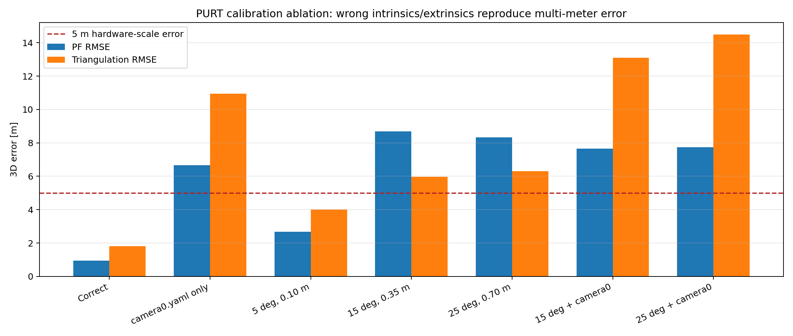
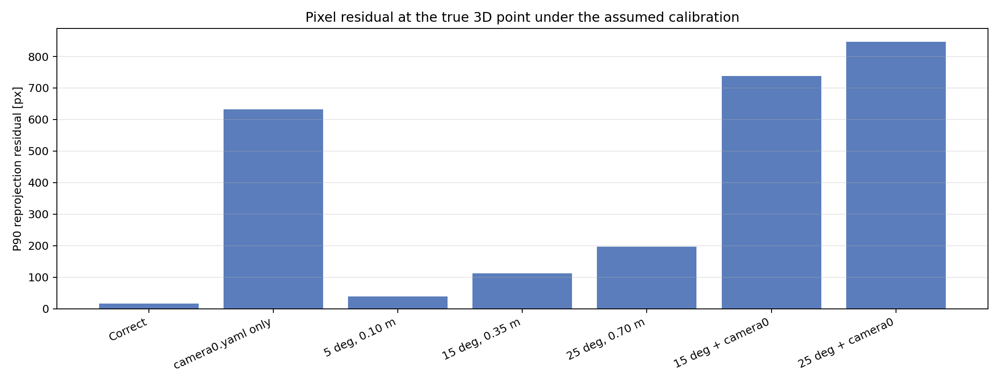
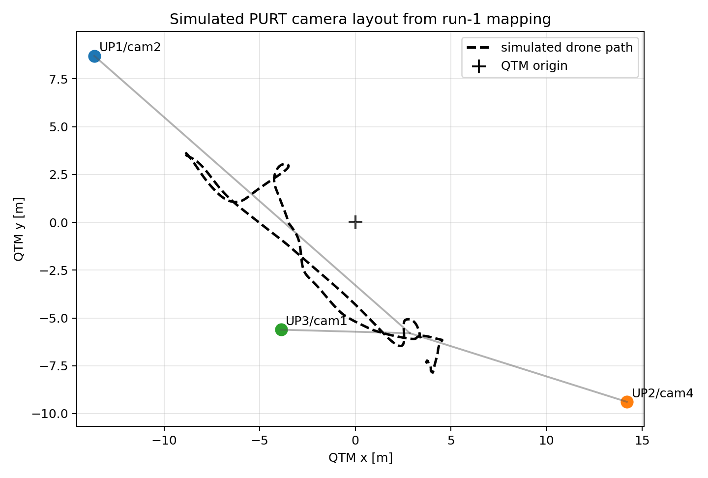
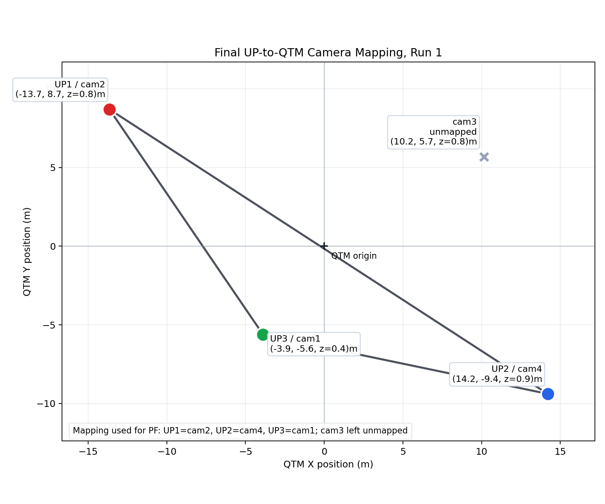
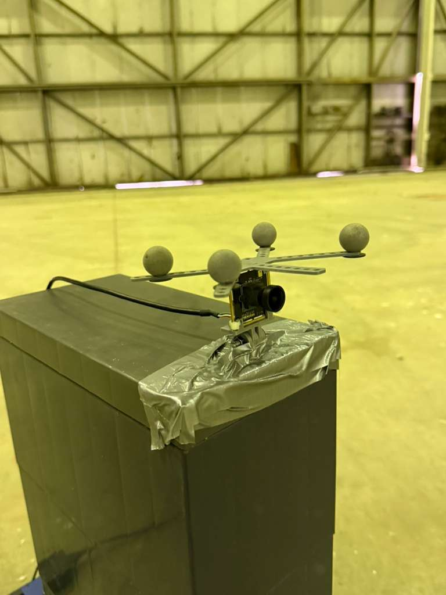

# Hardware Calibration Hypothesis Simulation

Generated by `lg_filter_comparison/hardware_calibration_ablation.py`.

## Question

The PURT hardware run on `2026-04-24` produced very large raw PF errors.  The
hypothesis tested here is:

1. the active-marker rigid bodies gave a stable QTM body pose, but that body
   pose was not the optical camera pose used by the projection model; and
2. the old `camera0.yaml` intrinsics were used for `640x480` UP camera images,
   which put the principal point and focal lengths in the wrong pixel frame.

This is a simulator ablation.  The image measurements are generated from a
clean PURT camera rig following the actual extracted PURT run-1 QTM motion,
then the filter is deliberately run with the wrong calibration.  That isolates
calibration error from detector, ROS timing, and QTM parsing.

## Hardware Inputs Mirrored In Simulation

- Real data root: `/home/siddharth/up_bags/2026-04-24`
- Hardware evaluation note: `/home/siddharth/visnet_ws/docs/hardware_real_data_evaluation.md`
- Confirmed stream/body mapping: `UP1 -> cam2`, `UP2 -> cam4`, `UP3 -> cam1`
- Active UP intrinsics: `640x480`, fx `338.972`, fy `340.546`, cx `320.473`, cy `235.618`
- Erroneous `camera0.yaml`: `1600x1200`, fx `847.429`, fy `851.364`, cx `801.181`, cy `589.046`
- PF bounds copied from the hardware tracker: `x in [-12, 6] m`,
  `y in [-10, 5] m`, `z in [0, 2.1] m`, speed clipped to `5 m/s`
- Drone trajectory: actual PURT run-1 QTM path from
  `/home/siddharth/Desktop/AAE 590 LGM/Project/lg_filter_comparison/results/hardware_qtm_run1_assets/drone_trajectory.csv`
- QTM trajectory source: `longest_visible_marker_proxy`,
  `5720` raw samples, resampled to
  `2134` simulation steps over
  `106.65 s`
- Synthetic optical axes in this ablation are aimed at the trajectory median:
  `(+2.86, -5.80, +1.09) m`

The key bug in `camera0.yaml` is the pixel frame.  It is a `1600x1200`
calibration:

```text
K_bad = [[847.42919, 0, 801.18149],
         [0, 851.36406, 589.04551],
         [0, 0, 1]]
```

but the UP bag images are `640x480`.  The active `up*.yaml` files correctly use

```text
K_up = [[338.97168, 0, 320.47260],
        [0, 340.54562, 235.61820],
        [0, 0, 1]]
```

## Lie-Group Projection Math For The Ablation

The true synthetic camera measurement is

$$
z_{j,k}=\pi\left(K_j, T_{j,cw}\bar p_{w,k}\right)+\nu_{j,k},
$$

where the camera extrinsic is the Lie-group element

$$
T_{j,cw}=(R_{j,cw},t_{j,cw})\in SE(3),
$$

and it maps world points into camera coordinates as

$$
p_{j,c,k} = R_{j,cw}p_{w,k} + t_{j,cw}.
$$

The pinhole projection is

$$
u=f_x X_c/Z_c+c_x,\qquad v=f_y Y_c/Z_c+c_y.
$$

The wrong-extrinsic cases use the same physical camera layout for measurement
generation, but the filter assumes

$$
\hat R_{j,wc} = R_{j,wc}\operatorname{Exp}(\delta\phi_j),
\qquad
\hat t_{j,wc} = t_{j,wc} + R_{j,wc}\delta c_j.
$$

Then

$$
\hat R_{j,cw} = \hat R_{j,wc}^T,\qquad
\hat t_{j,cw} = -\hat R_{j,wc}^T\hat t_{j,wc}.
$$

This models the practical hardware mistake: treating an active marker body
frame as if it were the camera optical frame, or using a weak hand-eye transform
between those two frames.

## Results

| Case | Assumed intrinsics | Extrinsic error | PF RMSE [m] | PF P90 [m] | Triangulation RMSE [m] | True-point P90 residual [px] | Step time [ms] |
|---|---|---|---:|---:|---:|---:|---:|
| Correct | `up*.yaml` | correct | 0.943 +/- 0.202 | 1.351 | 1.816 | 17.1 | 0.629 |
| camera0.yaml only | `camera0.yaml` | correct | 6.654 +/- 0.603 | 9.055 | 10.946 | 632.3 | 0.540 |
| 5 deg, 0.10 m | `up*.yaml` | 5 deg, 0.10 m | 2.679 +/- 0.189 | 4.010 | 4.012 | 38.8 | 0.508 |
| 15 deg, 0.35 m | `up*.yaml` | 15 deg, 0.35 m | 8.692 +/- 0.205 | 15.089 | 5.967 | 112.1 | 0.538 |
| 25 deg, 0.70 m | `up*.yaml` | 25 deg, 0.70 m | 8.331 +/- 0.183 | 13.671 | 6.306 | 197.6 | 0.486 |
| 15 deg + camera0 | `camera0.yaml` | 15 deg, 0.35 m | 7.650 +/- 0.133 | 10.662 | 13.098 | 738.5 | 0.472 |
| 25 deg + camera0 | `camera0.yaml` | 25 deg, 0.70 m | 7.740 +/- 0.292 | 11.064 | 14.493 | 847.0 | 0.471 |

The clean case is the control: with the correct `up*.yaml` intrinsics and the
correct optical extrinsics, PF RMSE is `0.943 m`.

Using `camera0.yaml` alone raises the PF RMSE to
`6.654 m`.  A marker-like optical-frame error
alone raises it to `8.692 m`.  Combining the same
marker-like extrinsic error with `camera0.yaml` raises it to
`7.650 m`, which is the same order as the
multi-meter hardware errors.











## Interpretation

The simulation supports your hypothesis.  The result is not saying the hardware
run was definitely caused only by calibration; the real run can still include
time offset, detector quality, and QTM marker visibility effects.  But it does
show that the calibration failure mode is sufficient: a `camera0.yaml` pixel
frame mismatch plus plausible marker-frame-to-optical-frame errors can produce
the observed 3-6 m class of raw PF error even when the simulated measurements
are otherwise clean.

The direct triangulation row is important because it removes PF tuning from the
argument.  If the same 2D points are triangulated through the wrong camera
model, the recovered 3D point is already wrong by meters.  The PF then starts
from and repeatedly gets pulled by that wrong geometry.

## Proposed Extension: Body-Frame-Acceleration Lie-Group PF

The current implemented PF in this report is a position/velocity bootstrap PF.
It does not estimate drone attitude.  A more Lie-group-centered extension is to
let each particle carry a latent inertial-navigation state while still reporting
only the drone trajectory:

$$
X_k^{(i)} =
\left(R_{wb,k}^{(i)}, v_{w,k}^{(i)}, p_{w,k}^{(i)}\right)
\in SE_2(3).
$$

Equivalently, one can write the particle state in block form as

$$
X_k^{(i)} =
\begin{bmatrix}
R_{wb,k}^{(i)} & v_{w,k}^{(i)} & p_{w,k}^{(i)}\\
0_{1\times 3} & 1 & 0\\
0_{1\times 3} & 0 & 1
\end{bmatrix}.
$$

Here \(R_{wb,k}^{(i)}\in SO(3)\) is a latent attitude hypothesis,
\(v_{w,k}^{(i)}\) is world-frame velocity, and \(p_{w,k}^{(i)}\) is the
world-frame position used for camera projection and for the final trajectory
metric.  The attitude is included only so that body-frame IMU readings can be
used correctly in prediction.

Let the body-frame IMU input be

$$
u_k=(\omega_{m,k}, a_{m,k}),
$$

where \(\omega_{m,k}\) is gyroscope angular velocity and \(a_{m,k}\) is the
accelerometer specific-force reading.  With sampled body-frame process noise
\(\eta_{\omega,k}^{(i)}\) and \(\eta_{a,k}^{(i)}\), and no additional IMU
state terms, the particle prediction is

$$
R_{wb,k+1}^{(i)}
=
R_{wb,k}^{(i)}
\operatorname{Exp}
\left(
\left(\omega_{m,k}+\eta_{\omega,k}^{(i)}\right)^\wedge \Delta t
\right).
$$

Equivalently, in code this should be implemented as

$$
R_{wb,k+1}^{(i)}
=
R_{wb,k}^{(i)}
\operatorname{Exp}_{SO(3)}
\left(
\left(\omega_{m,k}+\eta_{\omega,k}^{(i)}\right)\Delta t
\right).
$$

The accelerometer is mapped from body frame to world frame through the particle
attitude:

$$
a_{w,k}^{(i)}
=
R_{wb,k}^{(i)}
\left(a_{m,k}+\eta_{a,k}^{(i)}\right)
+g_w.
$$

If \(a_{m,k}\) is already gravity-compensated acceleration instead of specific
force, the \(g_w\) term is omitted.  The Euclidean velocity and position blocks
then propagate as

$$
v_{w,k+1}^{(i)}
=
v_{w,k}^{(i)}
+\Delta t\,a_{w,k}^{(i)},
$$

$$
p_{w,k+1}^{(i)}
=
p_{w,k}^{(i)}
+\Delta t\,v_{w,k}^{(i)}
+\frac{1}{2}\Delta t^2 a_{w,k}^{(i)}.
$$

The camera measurement update remains the same projection likelihood used in the
current PF:

$$
\hat z_{j,k}^{(i)}
=
\pi\left(K_j,T_{j,cw}\bar p_{w,k}^{(i)}\right),
\qquad
w_k^{(i)}
\propto
w_{k|k-1}^{(i)}
\prod_{j\in\mathcal V_k}
\mathcal N\left(z_{j,k};\hat z_{j,k}^{(i)},R_j\right).
$$

After normalization, resampling copies the entire latent state
\((R_{wb}^{(i)},v_w^{(i)},p_w^{(i)})\).  The reported trajectory estimate is
still only the weighted position mean:

$$
\hat p_{w,k}
=
\sum_{i=1}^{N_p} w_k^{(i)}p_{w,k}^{(i)}.
$$

This is the main conceptual point: the PF can carry latent attitude for
body-frame acceleration prediction without changing the output task into full
pose estimation.

### Left-Invariant Error: Diagnostic, Not The PF Estimate

For this particle filter, a left-invariant error is not needed to perform the
filter update.  The PF represents uncertainty directly with samples, so it does
not propagate a Kalman covariance or linearized error dynamics.  The
left-invariant error is still useful for explaining particle spread on the
group.

Given a weighted group mean \(\bar X_k\), define the particle error

$$
\eta_k^{(i)}=\bar X_k^{-1}X_k^{(i)}.
$$

The tangent-space error is

$$
\epsilon_k^{(i)}
=
\log\left(\bar X_k^{-1}X_k^{(i)}\right)^\vee.
$$

For \(SE_2(3)\), this error contains attitude, velocity, and position error
coordinates:

$$
\epsilon_k^{(i)}
\approx
\begin{bmatrix}
\delta\theta_k^{(i)}\\
\delta v_{b,k}^{(i)}\\
\delta p_{b,k}^{(i)}
\end{bmatrix}.
$$

The \(b\) subscript means the error is expressed in the body frame of the
reference mean.  It does not mean the filter estimates body-frame position or
body-frame velocity; the stored particle states remain \(p_w^{(i)}\) and
\(v_w^{(i)}\).

The weighted Lie-group mean is locally defined as

$$
\bar X_k
=
\arg\min_Y
\frac{1}{2}
\sum_i w_k^{(i)}
\left\|
\log\left(Y^{-1}X_k^{(i)}\right)^\vee
\right\|^2.
$$

Let

$$
\epsilon_i=
\log\left(\bar X_k^{-1}X_k^{(i)}\right)^\vee.
$$

Perturb the mean by

$$
Y=\bar X_k\operatorname{Exp}(\delta^\wedge).
$$

Then

$$
Y^{-1}X_k^{(i)}
=
\operatorname{Exp}(-\delta^\wedge)\bar X_k^{-1}X_k^{(i)}.
$$

Using the first-order Baker-Campbell-Hausdorff approximation near the mean,

$$
\log\left(Y^{-1}X_k^{(i)}\right)^\vee
\approx
\epsilon_i-\delta.
$$

So the local cost becomes

$$
J(\delta)
\approx
\frac{1}{2}
\sum_i w_k^{(i)}
\left\|\epsilon_i-\delta\right\|^2.
$$

At the optimum, the derivative at \(\delta=0\) must vanish:

$$
\left.
\frac{\partial J}{\partial \delta}
\right|_{\delta=0}
=
-\sum_i w_k^{(i)}\epsilon_i
=0.
$$

Therefore

$$
\sum_i w_k^{(i)}
\log\left(\bar X_k^{-1}X_k^{(i)}\right)^\vee
\approx 0.
$$

This is the Lie-group analogue of the Euclidean fact that weighted errors around
the mean sum to zero.  In this proposed PF, it should be presented as a
diagnostic or uncertainty-description tool, not as the state estimate itself.


## Filter Initialization In This Simulation

For the hardware-style PF ablation, the filter is initialized from the first
few camera measurements, not from the true state.  The code triangulates early
multi-camera bbox centers, takes the median of the early 3D anchors as the
initial position, and estimates initial velocity by a finite difference between
the first and last accepted anchors:

$$
\hat p_0 = \operatorname{median}(\tilde p_1,\ldots,\tilde p_{N_b}),
\qquad
\hat v_0 = \frac{\tilde p_{N_b}-\tilde p_1}{t_{N_b}-t_1}.
$$

This mirrors the hardware tracker bootstrap idea.  The particles are then drawn
around `[\hat p_0,\hat v_0]` using a broad covariance.  If the assumed
calibration is wrong, this bootstrap is also wrong, which is exactly the
failure mode we are testing.

The ground-truth velocity in the simulator is obtained from the QTM trajectory
by resampling position at a fixed rate and differentiating it numerically:

$$
v_k \approx \frac{p_{k+1}-p_{k-1}}{2\Delta t}.
$$

That velocity is used only as simulator truth and for error evaluation.  The PF
does not receive this true velocity.  It only receives 2D image measurements
and its own bootstrap/prediction model.

## Recommendation

For the next hardware pass, the calibration checklist should be:

- Use only the active `up1.yaml`, `up2.yaml`, and `up3.yaml` intrinsics for the
  `640x480` streams.
- Treat QTM active-marker poses as marker-body poses, not optical camera poses.
- Calibrate a fixed `T_marker,optical` transform for each physical camera, or
  fit optical `R_cw` from synchronized image detections and QTM drone positions.
- I will figure out a better way to get camera extrinsics, either with a proper
  hand-eye calibration between the active-marker body and optical frame, or by
  fitting optical extrinsics from QTM drone positions and image detections.
- Record a short checkerboard/AprilTag-style validation sequence for each UP
  camera so the intrinsic scaling and distortion model can be checked before
  the drone flight.
- Before PF, run a reprojection sanity check: project QTM drone positions into
  each camera and verify that the projected point lands on the detected drone.
  If the residual is hundreds of pixels, do not run the filter yet.
- Use a single global QTM/video offset, then verify it with image-space
  residuals over time.  Different best offsets per camera mean timing and
  calibration are still coupled.
- Start with a simple flight segment where the drone is visible in at least two
  cameras for several seconds; use that segment to validate camera
  triangulation before asking the PF to survive dropouts.
- Save the calibrated `camera_poses.json`, the exact camera YAMLs, and the QTM
  offset next to the bag outputs so the run can be reproduced exactly.
