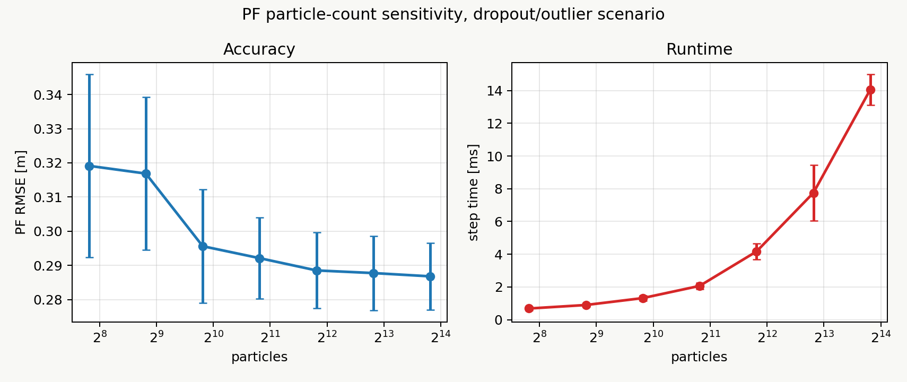
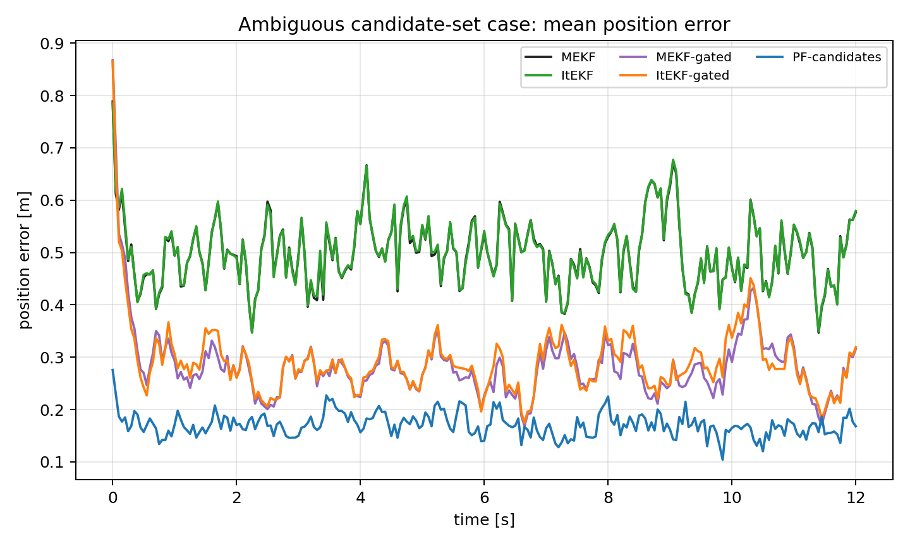
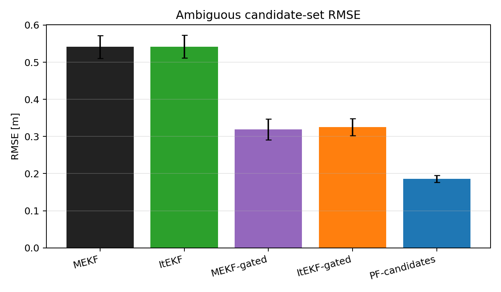
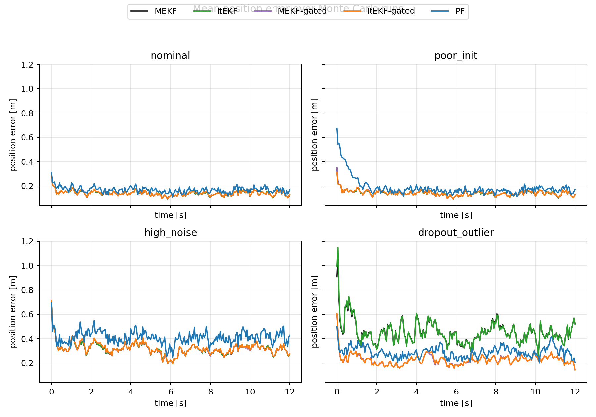
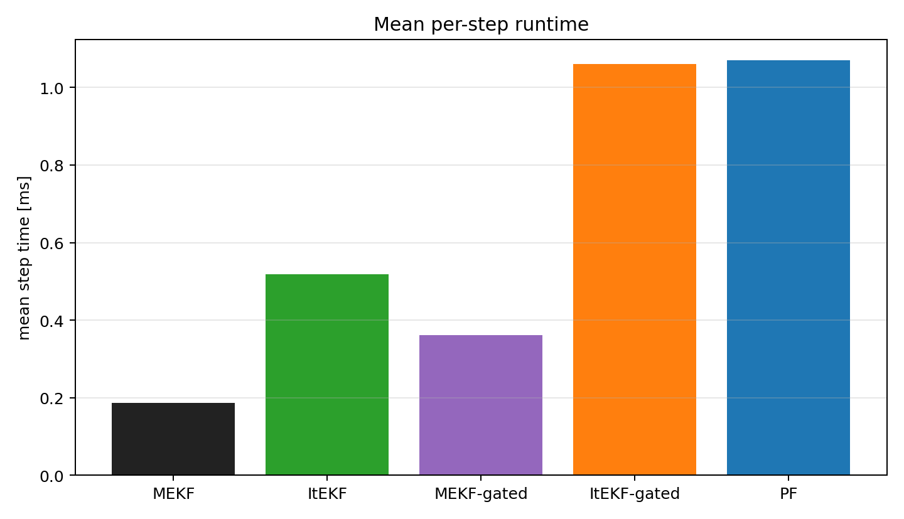
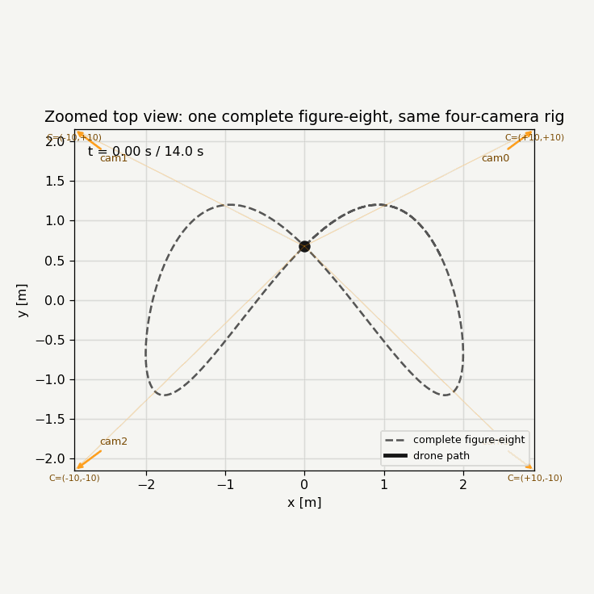

# Lie-Group Projection and Filter Comparison for Multi-Camera UAV Tracking

Generated by `lg_filter_comparison/run_comparison.py`.

## Executive Summary

This experiment compares four implemented estimator families under a shared
multi-camera UAV tracking simulation:

- **MEKF**: an error-state EKF over position and velocity. It is not a
  full body-frame pose-error EKF; because the current target state is
  `R^6`, its retraction reduces to addition.
- **ItEKF**: an Iterated EKF. It uses the same prediction model as MEKF, but
  relinearizes the nonlinear camera projection measurement several times inside
  each update.
- **MEKF-gated** and **ItEKF-gated**: the same EKF updates with per-camera
  Mahalanobis innovation gating. These variants show the fairer outlier
  comparison once a standard measurement-validation stage is included.
- **PF**: a bootstrap particle filter with likelihoods computed from
  multi-camera reprojection error using a robust per-camera mixture likelihood.

The important modeling decision is that the **estimated drone state is not a
full pose**. It is

```text
x = [p, v] = [x, y, z, vx, vy, vz] in R^6.
```

The Lie-group component is the **measurement model**: each camera pose is an
element of `SE(3)`, and projection is written as a map from world coordinates to
camera coordinates to pixels.

## Problem Statement

Given a fixed calibrated camera network and noisy image-space detections of a
single UAV, estimate the UAV 3D position over time. The filters receive only
2D bounding-box centers from each camera. They do not receive the true 3D
position except for evaluation.

The evaluation asks:

1. Can Lie-group notation cleanly represent the camera projection geometry?
2. How do the ungated EKFs, gated EKFs, and PF compare under nominal,
   poor-initialization, high-noise, and dropout/outlier conditions?
3. Which pieces benefit from Lie groups and which pieces remain Euclidean
   because the target attitude is not estimated?

## Simulation Pipeline

The ROS/Gazebo scene corresponding to this simulation is the Purdue world
(`purdue.sdf`) with four fixed camera feeds and one `x500` target spawned as
`drone1`. The GIF and Monte Carlo experiment intentionally use a single target;
outliers are synthetic false 2D detections, not a second tracked object. The
Monte Carlo code abstracts the rendered feeds into calibrated camera projections
and bbox-center measurements.

1. A compact figure-eight target trajectory is generated. The angular rate is
chosen so the default simulation completes one full figure-eight cycle:

$$
p_x(t)=a_x \sin(\omega t),\quad
p_y(t)=a_y \sin(2\omega t + \phi),\quad
p_z(t)=h + a_z \sin(c_z \omega t),\quad
\omega = 2\pi / 12.
$$

Velocity is computed analytically and used as the ground-truth `v(t)`.

2. Four cameras are placed around the workspace:

```text
camera0 = ( r,  r, h_c)
camera1 = (-r,  r, h_c)
camera2 = (-r, -r, h_c)
camera3 = ( r, -r, h_c)
```

The Gazebo cameras are yaw-only cameras whose model/link +X axis points toward
the workspace. In the projection code they are converted into the usual optical
camera convention:

```text
camera x = image right, camera y = image down, camera z = forward.
```

Camera extrinsics/intrinsics used by the Monte Carlo code and the ROS GIF:

| Camera | C_w [m] | yaw [deg] | fx | fy | cx | cy | image |
|---|---:|---:|---:|---:|---:|---:|---:|
| camera_0 | (+9.97, +9.89, +10.05) | -134.6 | 343.0 | 343.0 | 320.0 | 240.0 | 640x480 |
| camera_1 | (-9.89, +9.97, +10.05) | -44.7 | 343.0 | 343.0 | 320.0 | 240.0 | 640x480 |
| camera_2 | (-9.96, -9.89, +10.05) | +44.7 | 343.0 | 343.0 | 320.0 | 240.0 | 640x480 |
| camera_3 | (+9.89, -9.96, +10.05) | +134.6 | 343.0 | 343.0 | 320.0 | 240.0 | 640x480 |

3. For camera `j`, the world-to-camera pose is represented as

$$
T_{j,cw} =
\begin{bmatrix}
R_{j,cw} & t_{j,cw} \\
0 & 1
\end{bmatrix} \in SE(3).
$$

4. A world point is transformed and projected:

$$
\bar p_{j,c,k} = T_{j,cw} \bar p_{w,k},\quad
p_{j,c,k} = [X_{j,c,k},Y_{j,c,k},Z_{j,c,k}]^\top.
$$

$$
\pi(K_j,p_{j,c,k})=
\begin{bmatrix}
f_{x,j} X_{j,c,k}/Z_{j,c,k} + c_{x,j} \\
f_{y,j} Y_{j,c,k}/Z_{j,c,k} + c_{y,j}
\end{bmatrix}.
$$

The measurement model for camera `j` at time `k` is therefore:

$$
z_{j,k} = h_j(x_k) + n_{j,k}
    = \pi(K_j, T_{j,cw} \bar p_{w,k}) + n_{j,k}.
$$

5. Pixel noise, optional dropout, and optional synthetic false detections are
applied to the projected detections. Dropout means the camera produced no usable
bbox for that frame. An outlier means the camera produced a bbox for the wrong
image location while the true drone is still visible.

6. All filter variants consume the same measurement sequence in each Monte Carlo
run.

## Lie-Group Interpretation

Only quantities that naturally live on manifolds are represented as Lie-group
objects:

- `R_cw in SO(3)` for camera rotation,
- `T_cw in SE(3)` for camera pose,
- measurement residuals are evaluated after mapping through the group action.

The compact camera block displayed under each camera feed is

$$
K^{(j)} =
\begin{bmatrix}
f_x^{(j)} & 0 & c_x^{(j)} \\
0 & f_y^{(j)} & c_y^{(j)} \\
0 & 0 & 1
\end{bmatrix},
$$

$$
T_{cw}^{(j)} =
\begin{bmatrix}
R_{cw}^{(j)} & t_{cw}^{(j)} \\
0 & 1
\end{bmatrix}
\in SE(3),
$$

where each camera has its own superscripted rotation and translation terms:

$$
R_{cw}^{(j)} =
\begin{bmatrix}
r_{11}^{(j)} & r_{12}^{(j)} & r_{13}^{(j)} \\
r_{21}^{(j)} & r_{22}^{(j)} & r_{23}^{(j)} \\
r_{31}^{(j)} & r_{32}^{(j)} & r_{33}^{(j)}
\end{bmatrix},
\quad
t_{cw}^{(j)} =
\begin{bmatrix}
t_x^{(j)} & t_y^{(j)} & t_z^{(j)}
\end{bmatrix}^\top.
$$

The GIF also lists the camera center as `t_wc^(j)`, where

$$
t_{cw}^{(j)} = -R_{cw}^{(j)}t_{wc}^{(j)}.
$$

For the GIF caption, the vectorized display is therefore:

$$
\operatorname{vec}(T_{cw}^{(j)}) =
\begin{bmatrix}
r_{11}^{(j)} & r_{12}^{(j)} & \cdots & r_{33}^{(j)} &
t_x^{(j)} & t_y^{(j)} & t_z^{(j)}
\end{bmatrix}^\top.
$$

If we embed the same fixed camera extrinsic in `SE_2(3)`, the navigation
velocity slot is zero:

$$
X_{cw}^{(j)} =
\begin{bmatrix}
R_{cw}^{(j)} & 0 & t_{cw}^{(j)} \\
0 & 1 & 0 \\
0 & 0 & 1
\end{bmatrix}.
$$

Because the target state is currently `R^6`, the prediction model remains:

$$
p_{k+1} = p_k + \Delta t\,v_k + w_p,\quad
v_{k+1} = v_k + w_v.
$$

This can be written as a translation-group update, but since the translation
group is Abelian it is numerically the same as addition. A true full-pose
filter would instead use, for example,

$$
T_{k+1} = T_k \operatorname{Exp}(\Delta t\,\xi_k).
$$

That extension is outside this position-only comparison.

## Filter Math

### Full Lie-Group Pose Filter Form, Not Used Here

If this were a pose-estimation problem, the filter state could live directly on
`SE(3)`:

$$
X_k =
\begin{bmatrix}
R_k & p_k \\
0 & 1
\end{bmatrix}\in SE(3),
\quad
X_{k+1} = X_k\operatorname{Exp}(\xi_k^\wedge\Delta t).
$$

A left-invariant error for a full-pose Lie-group construction
would be

$$
\eta_k = \hat X_k^{-1}X_k,\quad
\delta\xi_k = \operatorname{Log}(\eta_k)^\vee.
$$

After a measurement update,

$$
\delta\xi_k = K r_k,\quad
\hat X_k^+ = \hat X_k^-\operatorname{Exp}(\delta\xi_k^\wedge).
$$

For a pose-plus-velocity navigation state, we would more naturally use
`SE_2(3)`:

$$
\chi_k =
\begin{bmatrix}
R_k & v_k & p_k \\
0 & 1 & 0 \\
0 & 0 & 1
\end{bmatrix}\in SE_2(3),
\quad
\eta_k=\hat\chi_k^{-1}\chi_k,\quad
\delta\xi_k=\operatorname{Log}(\eta_k)^\vee.
$$

Those expressions are mathematically useful for the report because they show
what a true body-frame/invariant pose filter would look like. They are not the
implemented state model here: our drone orientation is not being estimated, so
the active state is only

$$
x_k =
\begin{bmatrix}p_{w,k} \\ v_{w,k}\end{bmatrix}\in R^6.
$$

The only Lie-group operation used in the implemented comparison is the camera
projection through `T_cw^(j) in SE(3)`.

### MEKF / Error-State EKF

Prediction:

$$
\hat x_k^- = F\hat x_{k-1}^+,\quad
P_k^- = F P_{k-1}^+ F^\top + Q,
$$

where

$$
F =
\begin{bmatrix}
I & \Delta t I \\
0 & I
\end{bmatrix}.
$$

At time `k`, all valid camera measurements are stacked into one vector:

$$
z_k =
\operatorname{stack}_{j\in\mathcal V_k} z_{j,k},
\qquad
h(\hat x_k^-)=
\operatorname{stack}_{j\in\mathcal V_k} h_j(\hat x_k^-).
$$

Here `\mathcal V_k` is the set of cameras that have valid measurements at time
`k`. The EKF measurement Jacobian is

$$
H_k =
\left.\frac{\partial h}{\partial x}\right|_{\hat x_k^-}.
$$

For a single camera `j`, the corresponding two-row block is

$$
H_{j,k} =
\begin{bmatrix}
J_{\pi,j,k}R_{j,cw} & 0_{2\times 3}
\end{bmatrix},
$$

where

$$
J_{\pi,j,k} =
\begin{bmatrix}
f_{x,j}/Z_{j,c,k} & 0 & -f_{x,j}X_{j,c,k}/Z_{j,c,k}^2 \\
0 & f_{y,j}/Z_{j,c,k} & -f_{y,j}Y_{j,c,k}/Z_{j,c,k}^2
\end{bmatrix}.
$$

This `H_{j,k}` maps a small state perturbation
`delta x = [delta p_w, delta v_w]` into pixel motion. The right block is zero
because the camera measurement directly depends on position, not velocity; the
velocity still matters through prediction.

The MEKF measurement update is then:

$$
r_k = z_k - h(\hat x_k^-),\quad
S_k = H_k P_k^- H_k^\top + R_k,
$$

$$
K_k = P_k^- H_k^\top S_k^{-1},\quad
\delta x_k = K_k r_k,
$$

$$
\hat x_k^+ = \hat x_k^- \oplus \delta x_k.
$$

Here `oplus` is addition because the estimated state is `R^6`.

### Iterated EKF (ItEKF)

The ItEKF uses the same prediction as the MEKF. The difference is only in the
measurement correction.  Instead of linearizing the camera projection once at
the predicted state, it repeatedly relinearizes around the current corrected
guess.

Start each measurement update from the predicted state:

$$
\delta x_{k,0} = 0,\qquad
x_{k,\ell} = \hat x_k^- + \delta x_{k,\ell}.
$$

At iteration `\ell`, evaluate the nonlinear projection and its Jacobian at
`x_{k,\ell}`:

$$
\hat z_{k,\ell} = h(x_{k,\ell}),\qquad
H_{k,\ell} =
\left.\frac{\partial h}{\partial x}\right|_{x_{k,\ell}}.
$$

The iterated EKF residual is written relative to the predicted state:

$$
r_{k,\ell} =
z_k - \hat z_{k,\ell} + H_{k,\ell}\delta x_{k,\ell}.
$$

Then the Kalman system is solved using the predicted covariance:

$$
S_{k,\ell} = H_{k,\ell} P_k^- H_{k,\ell}^\top + R_k,
\qquad
K_{k,\ell} = P_k^- H_{k,\ell}^\top S_{k,\ell}^{-1},
$$

$$
\delta x_{k,\ell+1}=K_{k,\ell} r_{k,\ell}.
$$

After a small fixed number of iterations, or once
`\|\delta x_{k,\ell+1}-\delta x_{k,\ell}\|` is small, the update is
committed:

$$
\hat x_k^+ = \hat x_k^- + \delta x_{k,L}.
$$

The covariance is updated with the final Jacobian and gain:

$$
P_k^+ =
(I-K_{k,L}H_{k,L})P_k^-(I-K_{k,L}H_{k,L})^\top
+ K_{k,L} R_k K_{k,L}^\top.
$$

This is an Iterated EKF, not an invariant EKF. Because the estimated state is
`R^6`, the retraction is ordinary addition. A true pose-state invariant filter
would instead update a group-valued state with an exponential-map correction.

### Gated MEKF / Gated ItEKF

The gated variants first test each camera's 2D innovation before including it in
the EKF update:

$$
d_{j,k}^2 =
r_{j,k}^\top
\left(H_{j,k} P_k^- H_{j,k}^\top + R_j\right)^{-1}
r_{j,k}.
$$

For camera `j`, the bbox center is accepted only if

$$
d_{j,k}^2 \le \gamma,
$$

where `gamma = 11.83`, approximately the 99.7 percent chi-square threshold for
a two-dimensional pixel measurement. This is not oracle cleaning: it uses only
the predicted measurement, covariance, and actual observed innovation.

### Bootstrap Particle Filter

Particles are predicted by:

$$
x_k^{(i)} = f(x_{k-1}^{(i)}) + q_k^{(i)}.
$$

Each particle is projected into every camera:

$$
\hat z_{j,k}^{(i)} =
h_j(x_k^{(i)})
= \pi(K_j, T_{j,cw}\bar p_{w,k}^{(i)}).
$$

Weights are assigned from pixel reprojection error using a robust per-camera
mixture likelihood. Each camera contributes a Gaussian term for ordinary pixel
noise plus a small outlier floor so a single false bbox cannot annihilate
otherwise plausible particles:

$$
\omega_k^{(i)} \propto
\exp\left(
\sum_j
\log\left[
\exp\left(-\frac{1}{2}
\left\|\frac{z_{j,k}-\hat z_{j,k}^{(i)}}{\sigma_z}\right\|^2
\right)
+\epsilon_{out}
\right]
\right).
$$

The state estimate is computed before resampling, and particles are
systematically resampled when the effective sample size is low.

## Code Map

- `lie_projection.py`: `SE3`, `SO(3)`/`SE(3)` helpers, four-camera rig, Lie-group projection, and analytic projection Jacobian.
- `filters.py`: ungated MEKF/ItEKF, gated MEKF/ItEKF, and robust PF implementations.
- `ambiguous_candidate_case.py`: candidate-set detector ambiguity case where the PF uses a mixture likelihood.
- `make_ros_camera_feed_cases.py`: report-ready ROS/Gazebo camera-feed GIF crops for nominal, high-noise, and dropout/outlier measurement streams.
- `run_comparison.py`: scenario definitions, Monte Carlo runner, plots, CSV table, and this report.

## Scenarios

- `nominal`: pixel sigma `8.0` px, init position bias `[0.7, -0.5, 0.25]`, dropout `0.0`, outlier `0.0`.
- `poor_init`: pixel sigma `8.0` px, init position bias `[2.5, -2.0, 0.9]`, dropout `0.0`, outlier `0.0`.
- `high_noise`: pixel sigma `22.0` px, init position bias `[0.9, -0.7, 0.25]`, dropout `0.0`, outlier `0.0`.
- `dropout_outlier`: pixel sigma `12.0` px, init position bias `[1.0, -0.8, 0.35]`, dropout `0.18`, outlier `0.06`.

## Dropout vs Anomaly/Outlier Detection

These are different measurement-failure modes.

**Dropout** means the camera gives no usable bbox for that frame. In code, the
measurement mask for that camera is set false, so the filter simply skips that
camera update and relies on prediction plus any remaining cameras. Increasing
the dropout rate makes the problem less observable and increases drift, but it
does not create an anomaly-detection problem by itself because there is no bad
measurement to identify.

**Anomaly/outlier detection** means a measurement exists, but it is inconsistent
with the predicted camera projection or the multi-camera geometry. If an EKF
trusts that bbox directly, the estimate can be pulled toward the wrong 3D
location. This is why the fair EKF comparison includes Mahalanobis gating, and
why the PF uses a robust likelihood with an outlier floor.

So increasing dropout is not equivalent to anomaly detection. If an anomaly
detector or gate rejects a bad bbox, then the downstream filter may treat that
camera as a dropout for that update, but the detection/rejection step is the
extra piece. The ambiguous candidate-set experiment is different again: the
filter receives multiple plausible bboxes, and the PF can keep multiple
hypotheses alive through a mixture likelihood instead of committing to one
association immediately.

Simulation configuration:

```json
{
  "runs": 12,
  "particles": 450,
  "duration_s": 12.0,
  "dt_s": 0.05,
  "seed": 590,
  "filters": [
    "MEKF",
    "ItEKF",
    "MEKF-gated",
    "ItEKF-gated",
    "PF"
  ]
}
```

## Filter Initialization In Software Simulation

The main Monte Carlo software simulation initializes all filters from the same
controlled prior, not from camera triangulation.  At the first time step, the
truth state is

$$
x_0 = [p_0, v_0].
$$

The simulation then applies a prescribed initial bias and covariance:

$$
\hat x_0 = x_0 + b_0,\qquad P_0=\operatorname{diag}(\sigma_{p,x}^2,\ldots,\sigma_{v,z}^2).
$$

The EKF-style filters receive `(\hat x_0, P_0)`.  The PF receives the same
prior by sampling particles:

$$
x_0^{(n)} \sim \mathcal N(\hat x_0,P_0),\qquad w_0^{(n)} = 1/N.
$$

So in the software Monte Carlo comparison, the initial velocity is part of the
same controlled prior: the truth velocity is computed analytically from the
figure-eight trajectory, then the configured velocity bias/noise is applied.
This is done for fairness, so MEKF, ItEKF, gated EKFs, and PF all start with
the same amount of initialization error.

The hardware-style ablation later in this report uses a different bootstrap:
early camera bbox centers are triangulated into rough 3D anchors, initial
position is the median of those anchors, and initial velocity is estimated by
finite difference between early anchors.  That version deliberately tests how a
bad camera model can corrupt the PF before the first update.

## Results

| Scenario | Filter | RMSE mean [m] | RMSE std [m] | Mean error [m] | P90 [m] | Final [m] | Step time [ms] |
|---|---:|---:|---:|---:|---:|---:|---:|
| nominal | MEKF | 0.1532 | 0.0075 | 0.1407 | 0.2207 | 0.1283 | 0.170 |
| nominal | ItEKF | 0.1533 | 0.0075 | 0.1408 | 0.2209 | 0.1284 | 0.489 |
| nominal | MEKF-gated | 0.1542 | 0.0084 | 0.1414 | 0.2234 | 0.1289 | 0.348 |
| nominal | ItEKF-gated | 0.1540 | 0.0083 | 0.1414 | 0.2224 | 0.1293 | 1.017 |
| nominal | PF | 0.1831 | 0.0068 | 0.1678 | 0.2649 | 0.1701 | 1.039 |
| poor_init | MEKF | 0.1548 | 0.0076 | 0.1418 | 0.2241 | 0.1283 | 0.179 |
| poor_init | ItEKF | 0.1546 | 0.0077 | 0.1417 | 0.2239 | 0.1284 | 0.480 |
| poor_init | MEKF-gated | 0.1558 | 0.0086 | 0.1426 | 0.2263 | 0.1289 | 0.347 |
| poor_init | ItEKF-gated | 0.1553 | 0.0084 | 0.1423 | 0.2248 | 0.1293 | 1.008 |
| poor_init | PF | 0.2152 | 0.0245 | 0.1859 | 0.3039 | 0.1716 | 1.026 |
| high_noise | MEKF | 0.3455 | 0.0217 | 0.3163 | 0.5057 | 0.2686 | 0.207 |
| high_noise | ItEKF | 0.3467 | 0.0220 | 0.3173 | 0.5082 | 0.2695 | 0.567 |
| high_noise | MEKF-gated | 0.3475 | 0.0231 | 0.3180 | 0.5106 | 0.2738 | 0.388 |
| high_noise | ItEKF-gated | 0.3492 | 0.0232 | 0.3196 | 0.5134 | 0.2734 | 1.168 |
| high_noise | PF | 0.4463 | 0.0299 | 0.4098 | 0.6509 | 0.4279 | 1.142 |
| dropout_outlier | MEKF | 0.5392 | 0.0701 | 0.4532 | 0.8296 | 0.5242 | 0.193 |
| dropout_outlier | ItEKF | 0.5424 | 0.0824 | 0.4533 | 0.8281 | 0.5187 | 0.540 |
| dropout_outlier | MEKF-gated | 0.2478 | 0.0104 | 0.2251 | 0.3609 | 0.1440 | 0.363 |
| dropout_outlier | ItEKF-gated | 0.2490 | 0.0109 | 0.2257 | 0.3621 | 0.1434 | 1.048 |
| dropout_outlier | PF | 0.3169 | 0.0223 | 0.2883 | 0.4654 | 0.2039 | 1.075 |

## Computation Time

The table above includes the per-scenario mean update time. Averaged across
scenarios, the per-step computation time is:

| Filter | Mean Step Time [ms] | Std Across Scenarios [ms] |
|---|---:|---:|
| MEKF | 0.187 | 0.014 |
| ItEKF | 0.519 | 0.036 |
| MEKF-gated | 0.362 | 0.016 |
| ItEKF-gated | 1.060 | 0.064 |
| PF | 1.071 | 0.045 |

## PF Particle-Count Sensitivity

Increasing PF particles usually helps by reducing sampling error and
particle impoverishment, but the gain is sublinear while computation grows
roughly linearly. The sweep below uses the same dropout/outlier scenario.
The main comparison keeps `PF` at 450 particles as the practical baseline;
the sweep shows the stronger high-particle PF behavior separately.

| Particles | PF RMSE mean [m] | RMSE std [m] | P90 [m] | Step time [ms] |
|---:|---:|---:|---:|---:|
| 225 | 0.3191 | 0.0268 | 0.4590 | 0.684 |
| 450 | 0.3169 | 0.0223 | 0.4654 | 0.897 |
| 900 | 0.2956 | 0.0166 | 0.4344 | 1.319 |
| 1800 | 0.2921 | 0.0118 | 0.4308 | 2.065 |
| 3600 | 0.2885 | 0.0111 | 0.4192 | 4.167 |
| 7200 | 0.2878 | 0.0109 | 0.4188 | 7.747 |
| 14400 | 0.2868 | 0.0098 | 0.4145 | 14.055 |

Best tested PF: `14400` particles, `0.2868 m` RMSE, `14.055 ms` per step.
PF-450 baseline: `0.3169 m` RMSE, `0.897 ms` per step.
Best gated EKF in the same scenario: `MEKF-gated`, `0.2478 m` RMSE, `0.363 ms` per step.

Interpretation: more particles improve the PF, but in this mostly unimodal
camera-geometry experiment they do not by themselves beat a well-gated EKF.
The PF advantage should be presented in robustness terms: sampled posterior
representation, non-Gaussian uncertainty, and tolerance to ambiguous or false
detections. We should not claim PF wins merely by choosing a huge particle
count unless the Monte Carlo table actually supports that claim.




## PF Particle Count In Non-Outlier Cases

The same particle-count question was checked for the clean nominal,
poor-initialization, and high-pixel-noise cases. Here the measurements are
still single-target and mostly unimodal, so the EKF approximation is very
competitive. More particles reduce PF sampling error, but the PF remains
behind the best EKF in these clean cases.

| Scenario | Particles | PF RMSE mean [m] | RMSE std [m] | P90 [m] | Step time [ms] | Best EKF RMSE [m] |
|---|---:|---:|---:|---:|---:|---:|
| nominal | 450 | 0.1831 | 0.0068 | 0.2649 | 0.943 | 0.1532 |
| nominal | 1800 | 0.1773 | 0.0071 | 0.2575 | 2.626 | 0.1532 |
| nominal | 7200 | 0.1760 | 0.0059 | 0.2551 | 8.406 | 0.1532 |
| nominal | 14400 | 0.1761 | 0.0070 | 0.2536 | 16.657 | 0.1532 |
| poor_init | 450 | 0.2152 | 0.0245 | 0.3039 | 1.036 | 0.1546 |
| poor_init | 1800 | 0.1863 | 0.0117 | 0.2703 | 2.521 | 0.1546 |
| poor_init | 7200 | 0.1807 | 0.0082 | 0.2608 | 8.842 | 0.1546 |
| poor_init | 14400 | 0.1779 | 0.0075 | 0.2559 | 15.611 | 0.1546 |
| high_noise | 450 | 0.4463 | 0.0299 | 0.6509 | 0.812 | 0.3455 |
| high_noise | 1800 | 0.4252 | 0.0307 | 0.6096 | 2.084 | 0.3455 |
| high_noise | 7200 | 0.4174 | 0.0271 | 0.5995 | 7.537 | 0.3455 |
| high_noise | 14400 | 0.4127 | 0.0217 | 0.5900 | 16.449 | 0.3455 |

This is why the report presents PF as the robust sampled estimator rather
than claiming it is universally more accurate. The PF is the main research
object, but the clean-case baseline should show the true cost of using a
sampling method where a Gaussian filter is already well matched.


## Ambiguous Candidate-Set Case Where PF Is Preferable

This experiment keeps the same trajectory, camera rig, and position-only
state, but changes the detector output. Each visible camera can return a
set of candidate bbox centers: one true-looking candidate and one
independent false candidate. The false candidate has the higher detector
score with probability `0.70`, so a single-association EKF is often fed
the wrong bbox. This is not an oracle advantage for the PF: the PF receives
the whole unlabeled candidate set, not the true association.

For camera `j`, the detector candidate set at time `k` is

$$
Z_{j,k}=\{z_{j,k}^{(m)}\}_{m=1}^{M_{j,k}}.
$$

The EKF-style filters consume the top-scored association

$$
\tilde z_{j,k}=z_{j,k}^{(m^*)},\quad m^*=\arg\max_m s_{j,k}^{(m)}.
$$

The PF instead uses a candidate-mixture likelihood per camera:

$$
L_{j,k}(x_k^{(i)})=\epsilon+\sum_{m=1}^{M_{j,k}}\alpha_m
\exp\left[-\frac{1}{2}\left\|\frac{z_{j,k}^{(m)}-h_j(x_k^{(i)})}{\sigma_z}\right\|^2\right].
$$

The particle weights are updated as

$$
\omega_k^{(i)} \propto \omega_{k|k-1}^{(i)}\prod_j L_{j,k}(x_k^{(i)}).
$$

Because the false candidates are independent across cameras, they usually
do not correspond to a single physically consistent 3D point. The true
hypothesis is the one that remains jointly plausible across the camera rig,
which is exactly what the PF's multi-hypothesis likelihood can exploit.

| Filter | RMSE mean [m] | RMSE std [m] | Mean error [m] | P90 [m] | Final [m] | Step time [ms] |
|---|---:|---:|---:|---:|---:|---:|
| MEKF | 0.5413 | 0.0307 | 0.4990 | 0.7839 | 0.5768 | 0.145 |
| ItEKF | 0.5422 | 0.0306 | 0.4997 | 0.7840 | 0.5794 | 0.382 |
| MEKF-gated | 0.3189 | 0.0280 | 0.2834 | 0.4759 | 0.3157 | 0.257 |
| ItEKF-gated | 0.3251 | 0.0230 | 0.2909 | 0.4846 | 0.3193 | 0.705 |
| PF-candidates | 0.1860 | 0.0095 | 0.1710 | 0.2659 | 0.1681 | 0.969 |

Best filter in this case: `PF-candidates` with `0.1860 m` RMSE.

This comparison is against the current EKF machinery. A more sophisticated
multi-hypothesis EKF, JPDA, or MHT-style tracker could also consume the
candidate set, but that is a different estimator architecture.






## Figures







## Animated Simulation GIFs

The live ROS/Gazebo composite below is generated from the Purdue world camera
feeds using `ros_world_gif_recorder.py`. It is a qualitative visual demo, while
the numerical comparison above comes from the controlled Monte Carlo pipeline.
The recorder uses Gazebo `/clock`, and the top-left panel reports the XY loop
closure after one 12-second simulated figure-eight period:


The clean zoomed top view below uses the same camera rig, but crops around the
target motion so the complete figure-eight is obvious. This is the clearest
animation to use when explaining the simulation trajectory:



The cropped ROS/Gazebo camera-feed views below keep the buildings visible while
showing the true bbox and measured bbox directly in the four camera streams.
The bottom subtitles list the case name, pixel measurement noise `sigma_z`,
`K^{(i)}`, `R_{cw}^{(i)}`, and `t_{cw}^{(i)}`.

Nominal measurements use `sigma_z = 8 px` and no artificial dropouts/outliers:


High-noise measurements use `sigma_z = 22 px` and no artificial
dropouts/outliers:


The dropout/outlier visual uses `sigma_z = 12 px`, dropout probability `0.18`,
and outlier probability `0.06`:


## Hardware Story Visuals

The hardware-calibration hypothesis visual below combines a short real ROS-bag
camera-feed excerpt from `/UP1`, `/UP2`, and `/UP3`, the actual extracted PURT
QTM path replayed in simulation, and the calibration-ablation PF RMSE bars:


The static version is included for PDF/print contexts where GIF playback is not
available:


Direct files: [`hardware_hypothesis_story.gif`](figures/hardware_hypothesis_story.gif)
and [`hardware_hypothesis_pipeline.png`](figures/hardware_hypothesis_pipeline.png).

## Analytic Projection Jacobian

The experiment uses analytic NumPy Jacobians. The projection Jacobian is short,
explicit, and cheap to evaluate:

$$
\frac{\partial u}{\partial p_w}
=
\begin{bmatrix}
f_x/Z_c & 0 & -f_xX_c/Z_c^2
\end{bmatrix}R_{cw},
$$

$$
\frac{\partial v}{\partial p_w}
=
\begin{bmatrix}
0 & f_y/Z_c & -f_yY_c/Z_c^2
\end{bmatrix}R_{cw}.
$$

For this Monte Carlo particle-filter comparison, vectorized NumPy is the more
direct runtime choice.

## Fairness Note On Dropout And Outliers

The dropout/outlier scenario now includes both ungated and gated EKF variants.
The ungated rows answer: what happens if a recursive Gaussian filter trusts the
camera bbox stream directly? The gated rows answer: what happens if the EKFs use
a standard, non-oracle measurement validation stage? The PF row answers the same
robustness question using a per-camera outlier-mixture likelihood and sampled
posterior.

This is the fairer way to present the experiment. The ungated EKFs are still
useful because they expose the failure mode, but the gated EKFs are the more
realistic comparison to a robust PF in contaminated measurements.

The live ROS/Gazebo GIF should not be used as the metric source. It is a visual
storyboard with synthetic bboxes drawn onto rendered camera feeds. The metric
source is the Monte Carlo table, because it controls the measurement noise,
dropout, outliers, seeds, and ground-truth alignment exactly.

## Interpretation

The comparison should be read with one important caveat: since the current
state is position and velocity, the ItEKF and MEKF differ only in the nonlinear
measurement update. The ItEKF repeatedly relinearizes the projection model,
while the MEKF linearizes once per update. The PF differs more strongly because
it maintains a sampled distribution and uses robust likelihood weighting plus
resampling.

Particle methods usually tolerate poor initialization and outliers better
because they maintain a distribution instead of a single Gaussian estimate. EKF
gating can recover much of the outlier robustness at a far lower computational
cost when the posterior remains close to unimodal. The EKF-style filters are
typically faster per step because they propagate only a mean and covariance.

The absolute PF error in this report is higher than the earlier timestamp-fixed
ROS PF result because the assumptions are different. Here, the nominal pixel
noise is `8 px`, and the dropout/outlier scenario injects missing and false
camera detections. A quick sanity sweep with the same corrected camera geometry
gives PF errors near `10 cm` for `4 px` image noise and near `6 cm` for `2 px`
image noise, which is consistent with the earlier `10 cm` and `4.8 cm` range.
So the difference is mainly measurement-noise/stress-test configuration, not a
new timestamp regression.

## Future Work

The current implementation establishes the Lie-group projection model and a
fair comparison among MEKF, iterated EKF, gated EKFs, and PF. The next steps are:

- **Implement FPF on Lie groups**. This should be a future estimator, not a
  current result. The natural direction is to implement a Feedback Particle
  Filter whose innovation feedback is defined on the appropriate Lie group,
  then compare constant-gain, kernel, and Galerkin/Poisson-equation gain
  approximations against the current bootstrap PF.
- **Implement an equivariant filter**. If the project expands from position-only
  tracking to pose or pose-plus-velocity estimation on `SE(3)` or `SE_2(3)`,
  an equivariant filter would preserve the symmetry of the dynamics and
  measurement model more faithfully than the current Euclidean error-state
  approximation.
- **Accelerate high-particle PF with JAX/CasADi-style tooling**. The projection
  and likelihood evaluation are embarrassingly parallel across particles and
  cameras. JAX is the most promising path for `vmap`/`jit` and GPU execution
  when using thousands of particles. CasADi can still be useful for automatic
  differentiation and code generation of projection/Jacobian pieces, although
  the immediate speed win for PF is likely vectorized GPU evaluation.
- **Study genuinely multimodal and multitarget scenes**. The PF is most
  valuable when the posterior is non-Gaussian: multiple similar drones,
  confusing labels, birds/false detections, or crossing trajectories. Future
  work should extend the candidate-set experiment into multi-target tracking
  with explicit data association, label uncertainty, and possibly JPDA/MHT-style
  baselines.
- **Improve hardware data capture and storage**. The current hardware workflow
  records raw ROS image bags, which are heavy in memory and disk bandwidth.
  Future runs should use encoded video transport or compressed image topics,
  store the exact camera YAMLs and calibrated `camera_poses.json` with the bag,
  and support streaming evaluation instead of loading large raw image logs.
- **Close the hardware calibration loop**. A successful hardware run needs
  reliable `T_marker,optical` hand-eye calibration, a single global QTM/video
  time offset, and a pre-filter reprojection check. The practical rule should
  be: if QTM drone positions do not project near the detected drone in each
  camera, do not run PF yet.

## Conclusion

The Lie-group formulation is valuable and mathematically appropriate in the
measurement model:

$$
z_{j,k} = \pi(K_j, T_{j,cw}\bar p_{w,k}) + n_{j,k}.
$$

It makes the camera/world frame convention explicit. It does not by itself make
the current position-only PF faster. Speed comes primarily from vectorizing
projection and likelihood calculations. If the project later estimates the full
drone pose, then the state should move to `SE(3)` or `SE_2(3)`, and the
Lie-group formulation will become central to the prediction and correction
steps as well.

<!-- hardware_calibration_ablation:start -->
# Hardware Calibration Hypothesis Simulation

Generated by `lg_filter_comparison/hardware_calibration_ablation.py`.

## Question

The PURT hardware run on `2026-04-24` produced very large raw PF errors.  The
hypothesis tested here is:

1. the active-marker rigid bodies gave a stable QTM body pose, but that body
   pose was not the optical camera pose used by the projection model; and
2. the old `camera0.yaml` intrinsics were used for `640x480` UP camera images,
   which put the principal point and focal lengths in the wrong pixel frame.

This is a simulator ablation.  The image measurements are generated from a
clean PURT camera rig following the actual extracted PURT run-1 QTM motion,
then the filter is deliberately run with the wrong calibration.  That isolates
calibration error from detector, ROS timing, and QTM parsing.

## Hardware Inputs Mirrored In Simulation

- Real data root: `/home/siddharth/up_bags/2026-04-24`
- Hardware evaluation note: `/home/siddharth/visnet_ws/docs/hardware_real_data_evaluation.md`
- Confirmed stream/body mapping: `UP1 -> cam2`, `UP2 -> cam4`, `UP3 -> cam1`
- Active UP intrinsics: `640x480`, fx `338.972`, fy `340.546`, cx `320.473`, cy `235.618`
- Erroneous `camera0.yaml`: `1600x1200`, fx `847.429`, fy `851.364`, cx `801.181`, cy `589.046`
- PF bounds copied from the hardware tracker: `x in [-12, 6] m`,
  `y in [-10, 5] m`, `z in [0, 2.1] m`, speed clipped to `5 m/s`
- Drone trajectory: actual PURT run-1 QTM path from
  `/home/siddharth/Desktop/AAE 590 LGM/Project/lg_filter_comparison/results/hardware_qtm_run1_assets/drone_trajectory.csv`
- QTM trajectory source: `longest_visible_marker_proxy`,
  `5720` raw samples, resampled to
  `2134` simulation steps over
  `106.65 s`
- Synthetic optical axes in this ablation are aimed at the trajectory median:
  `(+2.86, -5.80, +1.09) m`

The key bug in `camera0.yaml` is the pixel frame.  It is a `1600x1200`
calibration:

```text
K_bad = [[847.42919, 0, 801.18149],
         [0, 851.36406, 589.04551],
         [0, 0, 1]]
```

but the UP bag images are `640x480`.  The active `up*.yaml` files correctly use

```text
K_up = [[338.97168, 0, 320.47260],
        [0, 340.54562, 235.61820],
        [0, 0, 1]]
```

## Lie-Group Projection Math For The Ablation

The true synthetic camera measurement is

$$
z_{j,k}=\pi\left(K_j, T_{j,cw}\bar p_{w,k}\right)+\nu_{j,k},
$$

where the camera extrinsic is the Lie-group element

$$
T_{j,cw}=(R_{j,cw},t_{j,cw})\in SE(3),
$$

and it maps world points into camera coordinates as

$$
p_{j,c,k} = R_{j,cw}p_{w,k} + t_{j,cw}.
$$

The pinhole projection is

$$
u=f_x X_c/Z_c+c_x,\qquad v=f_y Y_c/Z_c+c_y.
$$

The wrong-extrinsic cases use the same physical camera layout for measurement
generation, but the filter assumes

$$
\hat R_{j,wc} = R_{j,wc}\operatorname{Exp}(\delta\phi_j),
\qquad
\hat t_{j,wc} = t_{j,wc} + R_{j,wc}\delta c_j.
$$

Then

$$
\hat R_{j,cw} = \hat R_{j,wc}^T,\qquad
\hat t_{j,cw} = -\hat R_{j,wc}^T\hat t_{j,wc}.
$$

This models the practical hardware mistake: treating an active marker body
frame as if it were the camera optical frame, or using a weak hand-eye transform
between those two frames.

## Results

| Case | Assumed intrinsics | Extrinsic error | PF RMSE [m] | PF P90 [m] | Triangulation RMSE [m] | True-point P90 residual [px] | Step time [ms] |
|---|---|---|---:|---:|---:|---:|---:|
| Correct | `up*.yaml` | correct | 0.943 +/- 0.202 | 1.351 | 1.816 | 17.1 | 0.629 |
| camera0.yaml only | `camera0.yaml` | correct | 6.654 +/- 0.603 | 9.055 | 10.946 | 632.3 | 0.540 |
| 5 deg, 0.10 m | `up*.yaml` | 5 deg, 0.10 m | 2.679 +/- 0.189 | 4.010 | 4.012 | 38.8 | 0.508 |
| 15 deg, 0.35 m | `up*.yaml` | 15 deg, 0.35 m | 8.692 +/- 0.205 | 15.089 | 5.967 | 112.1 | 0.538 |
| 25 deg, 0.70 m | `up*.yaml` | 25 deg, 0.70 m | 8.331 +/- 0.183 | 13.671 | 6.306 | 197.6 | 0.486 |
| 15 deg + camera0 | `camera0.yaml` | 15 deg, 0.35 m | 7.650 +/- 0.133 | 10.662 | 13.098 | 738.5 | 0.472 |
| 25 deg + camera0 | `camera0.yaml` | 25 deg, 0.70 m | 7.740 +/- 0.292 | 11.064 | 14.493 | 847.0 | 0.471 |

The clean case is the control: with the correct `up*.yaml` intrinsics and the
correct optical extrinsics, PF RMSE is `0.943 m`.

Using `camera0.yaml` alone raises the PF RMSE to
`6.654 m`.  A marker-like optical-frame error
alone raises it to `8.692 m`.  Combining the same
marker-like extrinsic error with `camera0.yaml` raises it to
`7.650 m`, which is the same order as the
multi-meter hardware errors.


## Interpretation

The simulation supports your hypothesis.  The result is not saying the hardware
run was definitely caused only by calibration; the real run can still include
time offset, detector quality, and QTM marker visibility effects.  But it does
show that the calibration failure mode is sufficient: a `camera0.yaml` pixel
frame mismatch plus plausible marker-frame-to-optical-frame errors can produce
the observed 3-6 m class of raw PF error even when the simulated measurements
are otherwise clean.

The direct triangulation row is important because it removes PF tuning from the
argument.  If the same 2D points are triangulated through the wrong camera
model, the recovered 3D point is already wrong by meters.  The PF then starts
from and repeatedly gets pulled by that wrong geometry.

## Proposed Extension: Body-Frame-Acceleration Lie-Group PF

The current implemented PF in this report is a position/velocity bootstrap PF.
It does not estimate drone attitude.  A more Lie-group-centered extension is to
let each particle carry a latent inertial-navigation state while still reporting
only the drone trajectory:

$$
X_k^{(i)} =
\left(R_{wb,k}^{(i)}, v_{w,k}^{(i)}, p_{w,k}^{(i)}\right)
\in SE_2(3).
$$

Equivalently, one can write the particle state in block form as

$$
X_k^{(i)} =
\begin{bmatrix}
R_{wb,k}^{(i)} & v_{w,k}^{(i)} & p_{w,k}^{(i)}\\
0_{1\times 3} & 1 & 0\\
0_{1\times 3} & 0 & 1
\end{bmatrix}.
$$

Here \(R_{wb,k}^{(i)}\in SO(3)\) is a latent attitude hypothesis,
\(v_{w,k}^{(i)}\) is world-frame velocity, and \(p_{w,k}^{(i)}\) is the
world-frame position used for camera projection and for the final trajectory
metric.  The attitude is included only so that body-frame IMU readings can be
used correctly in prediction.

Let the body-frame IMU input be

$$
u_k=(\omega_{m,k}, a_{m,k}),
$$

where \(\omega_{m,k}\) is gyroscope angular velocity and \(a_{m,k}\) is the
accelerometer specific-force reading.  With sampled body-frame process noise
\(\eta_{\omega,k}^{(i)}\) and \(\eta_{a,k}^{(i)}\), and no additional IMU
state terms, the particle prediction is

$$
R_{wb,k+1}^{(i)}
=
R_{wb,k}^{(i)}
\operatorname{Exp}
\left(
\left(\omega_{m,k}+\eta_{\omega,k}^{(i)}\right)^\wedge \Delta t
\right).
$$

Equivalently, in code this should be implemented as

$$
R_{wb,k+1}^{(i)}
=
R_{wb,k}^{(i)}
\operatorname{Exp}_{SO(3)}
\left(
\left(\omega_{m,k}+\eta_{\omega,k}^{(i)}\right)\Delta t
\right).
$$

The accelerometer is mapped from body frame to world frame through the particle
attitude:

$$
a_{w,k}^{(i)}
=
R_{wb,k}^{(i)}
\left(a_{m,k}+\eta_{a,k}^{(i)}\right)
+g_w.
$$

If \(a_{m,k}\) is already gravity-compensated acceleration instead of specific
force, the \(g_w\) term is omitted.  The Euclidean velocity and position blocks
then propagate as

$$
v_{w,k+1}^{(i)}
=
v_{w,k}^{(i)}
+\Delta t\,a_{w,k}^{(i)},
$$

$$
p_{w,k+1}^{(i)}
=
p_{w,k}^{(i)}
+\Delta t\,v_{w,k}^{(i)}
+\frac{1}{2}\Delta t^2 a_{w,k}^{(i)}.
$$

The camera measurement update remains the same projection likelihood used in the
current PF:

$$
\hat z_{j,k}^{(i)}
=
\pi\left(K_j,T_{j,cw}\bar p_{w,k}^{(i)}\right),
\qquad
w_k^{(i)}
\propto
w_{k|k-1}^{(i)}
\prod_{j\in\mathcal V_k}
\mathcal N\left(z_{j,k};\hat z_{j,k}^{(i)},R_j\right).
$$

After normalization, resampling copies the entire latent state
\((R_{wb}^{(i)},v_w^{(i)},p_w^{(i)})\).  The reported trajectory estimate is
still only the weighted position mean:

$$
\hat p_{w,k}
=
\sum_{i=1}^{N_p} w_k^{(i)}p_{w,k}^{(i)}.
$$

This is the main conceptual point: the PF can carry latent attitude for
body-frame acceleration prediction without changing the output task into full
pose estimation.

### Left-Invariant Error: Diagnostic, Not The PF Estimate

For this particle filter, a left-invariant error is not needed to perform the
filter update.  The PF represents uncertainty directly with samples, so it does
not propagate a Kalman covariance or linearized error dynamics.  The
left-invariant error is still useful for explaining particle spread on the
group.

Given a weighted group mean \(\bar X_k\), define the particle error

$$
\eta_k^{(i)}=\bar X_k^{-1}X_k^{(i)}.
$$

The tangent-space error is

$$
\epsilon_k^{(i)}
=
\log\left(\bar X_k^{-1}X_k^{(i)}\right)^\vee.
$$

For \(SE_2(3)\), this error contains attitude, velocity, and position error
coordinates:

$$
\epsilon_k^{(i)}
\approx
\begin{bmatrix}
\delta\theta_k^{(i)}\\
\delta v_{b,k}^{(i)}\\
\delta p_{b,k}^{(i)}
\end{bmatrix}.
$$

The \(b\) subscript means the error is expressed in the body frame of the
reference mean.  It does not mean the filter estimates body-frame position or
body-frame velocity; the stored particle states remain \(p_w^{(i)}\) and
\(v_w^{(i)}\).

The weighted Lie-group mean is locally defined as

$$
\bar X_k
=
\arg\min_Y
\frac{1}{2}
\sum_i w_k^{(i)}
\left\|
\log\left(Y^{-1}X_k^{(i)}\right)^\vee
\right\|^2.
$$

Let

$$
\epsilon_i=
\log\left(\bar X_k^{-1}X_k^{(i)}\right)^\vee.
$$

Perturb the mean by

$$
Y=\bar X_k\operatorname{Exp}(\delta^\wedge).
$$

Then

$$
Y^{-1}X_k^{(i)}
=
\operatorname{Exp}(-\delta^\wedge)\bar X_k^{-1}X_k^{(i)}.
$$

Using the first-order Baker-Campbell-Hausdorff approximation near the mean,

$$
\log\left(Y^{-1}X_k^{(i)}\right)^\vee
\approx
\epsilon_i-\delta.
$$

So the local cost becomes

$$
J(\delta)
\approx
\frac{1}{2}
\sum_i w_k^{(i)}
\left\|\epsilon_i-\delta\right\|^2.
$$

At the optimum, the derivative at \(\delta=0\) must vanish:

$$
\left.
\frac{\partial J}{\partial \delta}
\right|_{\delta=0}
=
-\sum_i w_k^{(i)}\epsilon_i
=0.
$$

Therefore

$$
\sum_i w_k^{(i)}
\log\left(\bar X_k^{-1}X_k^{(i)}\right)^\vee
\approx 0.
$$

This is the Lie-group analogue of the Euclidean fact that weighted errors around
the mean sum to zero.  In this proposed PF, it should be presented as a
diagnostic or uncertainty-description tool, not as the state estimate itself.


## Filter Initialization In This Simulation

For the hardware-style PF ablation, the filter is initialized from the first
few camera measurements, not from the true state.  The code triangulates early
multi-camera bbox centers, takes the median of the early 3D anchors as the
initial position, and estimates initial velocity by a finite difference between
the first and last accepted anchors:

$$
\hat p_0 = \operatorname{median}(\tilde p_1,\ldots,\tilde p_{N_b}),
\qquad
\hat v_0 = \frac{\tilde p_{N_b}-\tilde p_1}{t_{N_b}-t_1}.
$$

This mirrors the hardware tracker bootstrap idea.  The particles are then drawn
around `[\hat p_0,\hat v_0]` using a broad covariance.  If the assumed
calibration is wrong, this bootstrap is also wrong, which is exactly the
failure mode we are testing.

The ground-truth velocity in the simulator is obtained from the QTM trajectory
by resampling position at a fixed rate and differentiating it numerically:

$$
v_k \approx \frac{p_{k+1}-p_{k-1}}{2\Delta t}.
$$

That velocity is used only as simulator truth and for error evaluation.  The PF
does not receive this true velocity.  It only receives 2D image measurements
and its own bootstrap/prediction model.

## Recommendation

For the next hardware pass, the calibration checklist should be:

- Use only the active `up1.yaml`, `up2.yaml`, and `up3.yaml` intrinsics for the
  `640x480` streams.
- Treat QTM active-marker poses as marker-body poses, not optical camera poses.
- Calibrate a fixed `T_marker,optical` transform for each physical camera, or
  fit optical `R_cw` from synchronized image detections and QTM drone positions.
- I will figure out a better way to get camera extrinsics, either with a proper
  hand-eye calibration between the active-marker body and optical frame, or by
  fitting optical extrinsics from QTM drone positions and image detections.
- Record a short checkerboard/AprilTag-style validation sequence for each UP
  camera so the intrinsic scaling and distortion model can be checked before
  the drone flight.
- Before PF, run a reprojection sanity check: project QTM drone positions into
  each camera and verify that the projected point lands on the detected drone.
  If the residual is hundreds of pixels, do not run the filter yet.
- Use a single global QTM/video offset, then verify it with image-space
  residuals over time.  Different best offsets per camera mean timing and
  calibration are still coupled.
- Start with a simple flight segment where the drone is visible in at least two
  cameras for several seconds; use that segment to validate camera
  triangulation before asking the PF to survive dropouts.
- Save the calibrated `camera_poses.json`, the exact camera YAMLs, and the QTM
  offset next to the bag outputs so the run can be reproduced exactly.

<!-- hardware_calibration_ablation:end -->
