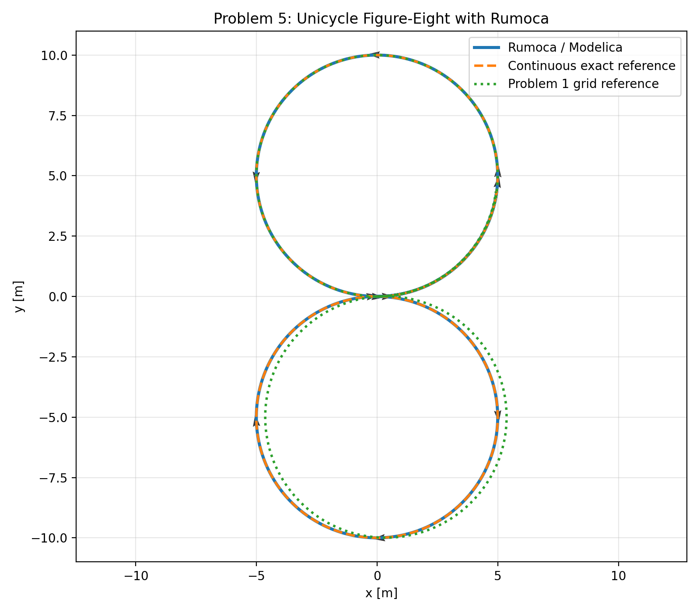

# PS04 Solution Workspace

Solution materials for PS04 in **Lie Group Methods for Estimation and Control**. This folder contains notebooks, model files, and generated results only; the original problem statement PDF is intentionally excluded.

## Visual Result

## Files

| Path | Description |
|---|---|
| `notebooks/PS_04_AAE590LGM.ipynb` | Main solution notebook covering helper functions, `SE(2)` propagation, unicycle simulation, and distribution analysis. |
| `notebooks/PS_04_AAE590LGM_3.ipynb` | Additional solution notebook for later PS04 parts. |
| `notebooks/PS_04_AAE590LGM_4.ipynb` | Small follow-up notebook artifact from the solution workspace. |
| `modelica/Unicycle.mo` | Modelica unicycle model used for simulation/comparison work. |
| `modelica/problem5_rumoca_compare.py` | Python comparison script for the unicycle/RUMOCA experiment. |
| `results/problem5_rumoca_overlay.png` | Generated trajectory overlay image from the comparison workflow. |

## Reproducibility

The notebooks should open directly in Jupyter. The RUMOCA comparison script requires a compatible Modelica/RUMOCA installation in addition to the Python dependencies listed in the repository root.
